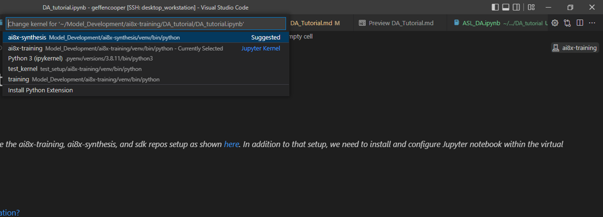

# How to setup Jupyter Notebook within a Virtual Environment

To use Jupyter notebook with a virtual environment we need to install ipykernel within the virtual environment and then install a new kernel. You will need to do this for both the ai8x-training and ai8x-synthesis virtual environments by running the commands below:

### Install ipykernel in the training environment
```console
(ai8x-training) geffencooper@msi1:~/Model_Development/ai8x-training$ pip install ipykernel
```

You might need to reload Visual Studio Code if the next command complains about not recognizing ipython.

### Install a new kernel
```console
(ai8x-training) geffencooper@msi1:~/Model_Development/ai8x-training$ ipython kernel install --user --name=ai8x-training
```

### Install ipykernel in the synthesis environment
```console
(ai8x-synthesis) geffencooper@msi1:~/Model_Development/ai8x-synthesis$ pip install ipykernel
```

You might need to reload Visual Studio Code if the next command complains about not recognizing ipython.

### Install a new kernel
```console
(ai8x-synthesis) geffencooper@msi1:~/Model_Development/ai8x-syntehsis$ ipython kernel install --user --name=ai8x-synthesis
```


If this was successful you should be able to see a small box in the top right corner which will bring down a dropdown of the available kernels (assuming you have a .ipynb notebook open) when clicked as shown in this image. If nothing shows up then try reloading Visual Studio Code again.
