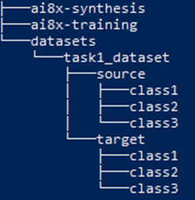
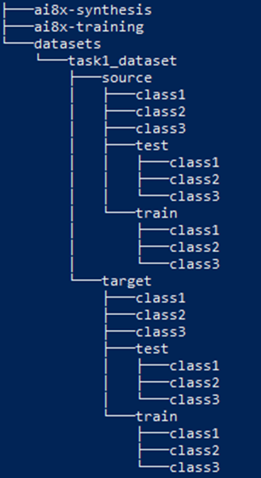
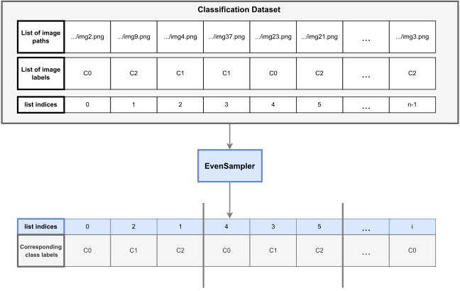

# Customizing FADA for Your Setup

This document explains how to use the FADA method for your own datasets and CNN architectures.

## Dataset Layout
In general if you want to use the provided dataloaders, you must structure your dataset in a spacific way. The directory structure is shown below.

### Standard Classification
<center>



</center>

This image shows the suggested directory structure. Create a datasets folder at the level of the 
```sh ai8x_synthesis``` and ```ai8x_training``` repos to store all your datasets. In general this folder can be located anywhere. Within that folder, the specific dataset you are using **must** have the depicted structure. There must be a folder for the **source** data and a folder for the **target** data. Withing those folders the different classes should be subdirectories with the names of the directories being the same as the class names. This is similar to PyTorch's ```ImageFolder()``` method. Then within each class directory, there should be **only** image files.

Then once the ```dataset_split.py``` script is used to split the source and target datasets into training and testing data, the directory structure will look like this. Note that the original dataset class directories remain and the images are copied to ```test``` and ```train``` directories in case the original dataset is neeeded later on.

<center>



</center>

The ```ClassificationDataset``` class will use this directory structure to generate (image, label) tuples for standard image classification.  

### Generating Image Pairs
For the FADA step of training, we need to generate four types of image pairs with the tuple structure (image1, image2, label). Recall the four classes are
* Class G1 --> source domain, same class
* Class G2 --> different domain, same class
* Class G3 --> source domain, different class
* Class G4 --> different domain, different class

The ```DomainAdaptationPairDataset``` class will build on top of the ```ClassificationDataset``` class to sample pairs from each class using a custom sampler class called ```EvenSampler```. The ```EvenSampler``` class takes in a ```ClassificationDataset``` object as input and samples it equally for each class. The diagram below shows this better.

<center>



</center>

As shown a ```ClassificationDataset``` stores the image paths and corresponding labels as parallel lists. However, these lists may be in arbitrary order. The EvensSampler takes the ```ClassificationDataset``` labels list and returns a list of indices (shown in blue) which correspond to sampling each class equally (e.g. C0, C1, C2, C0, C1, C2, C0, C1, C2, ...).

The ```DomainAdaptationPairDataset``` will create an ```EvenSampler``` for both the source and target. It then treats each full sequence of classes (i.e. (C0,C1,C2)) as a **partition**. Then to generate a random pair for class G1,G2,G3, or G4, it will randomly sample a partition (or two if G1,G3) from the corresponding sampler then randomly sample a class (or two different classes if G3,G4). This will return a pair of indices which can be used to index into the **source** and **target** ```ClassificationDataset``` objects to get the image paths and labels. These are finally put into tuples which are stored as two lists. This whole process is depicted in the diagram below which shows how a sample for G1 and G4 are created.

<center>


</center>

If you your data is structured or organized differently, you will need to modify the ```ClassificationDataset``` and ```DomainAdaptationPairDataset``` classes to work with your data.


## Architecture Layout
If you want to use your own architecture then you need to understand how the training process works. A diagram of the entire process is shown below.

<center>


</center>

For simplicity let's skip the pretraining step and assume you have a trained model that gets good test accuracy but performs poorly when synthesized onto the MAX78000 (start from the bottom two boxes). The goal then is to adapt the model so that it reduces the domain shift between the classes.

In general your model should have the generic structure CNN_layers --> FC_layers --> output. The first step is to train the domain-class discriminator. To do this you need to freeze the weights of the *encoder* part of the model (blue layers) and add a couple of fully connected layers for the discriminator part of the model (red layers). Rather than freezing, in PyTorch you can register a forward hook